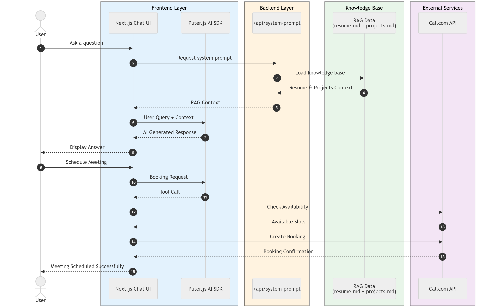

# Nagoor's AI Persona Chatbot

An interactive, RAG-powered AI chatbot acting as the professional persona of Shaik Nagoor Saheb. The assistant can answer questions about Nagoor's skills, experience, and projects, as well as seamlessly schedule meetings via Cal.com.

## Architecture Diagram



## Features

- **Conversational UI**: A modern, mobile-responsive chat interface built with Next.js and Tailwind CSS.
- **RAG-Powered Knowledge**: The AI answers questions based on a localized knowledge base containing Nagoor's resume and project portfolio.
- **Tool Calling (Scheduling)**: Integrated with the Cal.com v2 API to let the AI check availability and automatically book meetings right from the chat.
- **Puter.js Integration**: Uses Puter AI's client-side SDK (`window.puter.ai.chat`) for fast, serverless LLM generation. 
- **Protected Prompting**: Instructions guard the AI from prompt injection and off-topic conversations.

## Setup Instructions

### Prerequisites
1. **Node.js**: v18 or higher
2. **Cal.com Account**: Generate an API Key in your Cal.com settings.
3. **Cal.com Event Type ID**: The specific event type ID you want the AI to book slots for.

### 1. Clone & Install
```bash
git clone <repository_url>
cd ai-persona
npm install
```

### 2. Environment Variables
Create a `.env.local` file in the root directory and add your credentials:
```env
CAL_API_KEY=your_cal_com_api_key_here
CAL_EVENT_TYPE_ID=your_cal_com_event_type_id_here
```

### 3. Run the Development Server
```bash
npm run dev
```

### 4. Access the App
Open `http://localhost:3000` in your web browser. The chat UI will initialize and the assistant will be ready to chat.

## Project Structure

- `app/`: Next.js App Router setup.
- `app/api/`: Backend API routes for serving the RAG prompt (`system-prompt`) and securely proxying Cal.com requests (`book`).
- `components/ChatInterface.tsx`: The main client-side chat interface, managing message state and tool execution loops.
- `data/`: Markdown files (`resume.md`, `projects.md`) acting as the RAG knowledge base.
- `lib/`:
  - `rag.ts`: Reads and concatenates local markdown data.
  - `prompts.ts`: Defines system prompt constraints, injection rules, and tool schemas.
  - `booking.ts`: Handlers for checking availability and booking slots via Cal.com.

## Cost Breakdown

This application is extremely cost-effective as it relies on serverless and highly optimized services. 

### Per Chat Session (Approx. 5-10 messages)
- **LLM Costs (Puter.js / gpt-4o-mini)**: ~$0.001 - $0.003
  - Input: $0.150 per 1M tokens
  - Output: $0.600 per 1M tokens
  - Each message passes the RAG knowledge base context, making input context roughly 1.5K tokens per turn.
- **Cal.com API**: Free tier handles basic meeting queries and bookings without per-call charges.
- **Total Estimated Session Cost**: Under half a cent ($0.005).

### Per API Call
- **Chat Completion**: ~$0.0003 per turn.
- **Cal.com Availability / Book**: $0.00 (Standard API usage is free).
- **Vercel / Next.js Hosting**: Free tier covers up to 100GB bandwidth.
